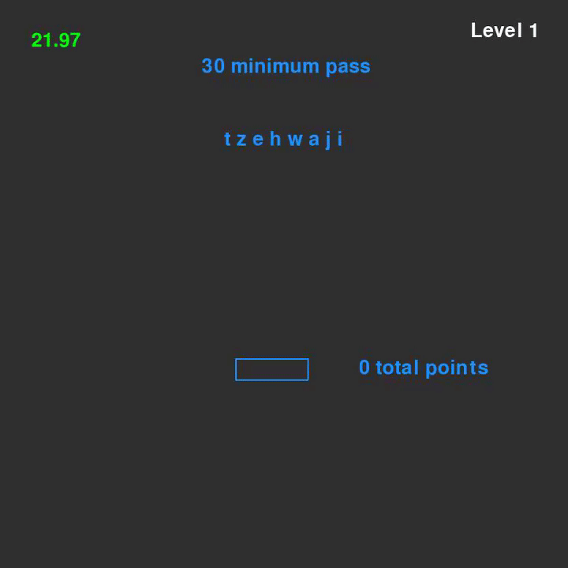

### Word Guessing Game

### Getting Started
To play, download the repository and navigate to to disc/guessingwords.exe and run the executable. 

### How to play

The premise of the Word Guessing game is to progress through levels by entering words using the characters available. Each character is assigned a value (from the scrabble index) which is incremented every level, based on the value of the current mash of letters. The player has an accumulated score to the right of the entry box, to judge their progress.

Time is ticking, so watchout for the timer on the top left. Once the 30 seconds are up, it's game over. In order to increase your time, you have to get your user score to pass the minimum passing score by entering valid words. 

### Dependencies
The only dependency required is the scrabble points dictionary, which was parsed from a textfile of all 170,000+ verified words. The list was parsed through python, and assigned their appropriate value and stored into a dictionary on scrabbleWordsDict.py.

### Feedback
If you have any feedback on the code, the algorithm used in the game, email me at tmarr006@fiu.edu. I'm always open to criticism in order to improve the enjoyability of the game!
